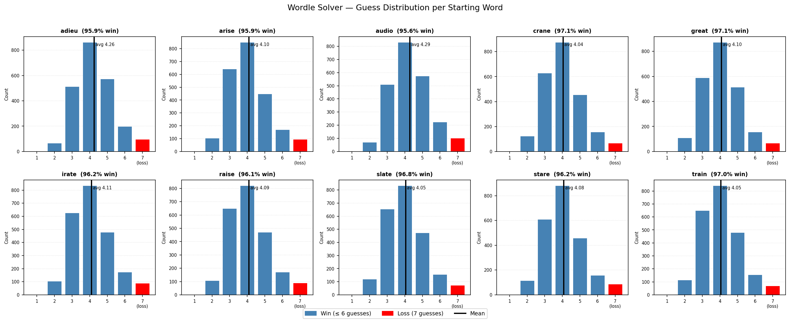
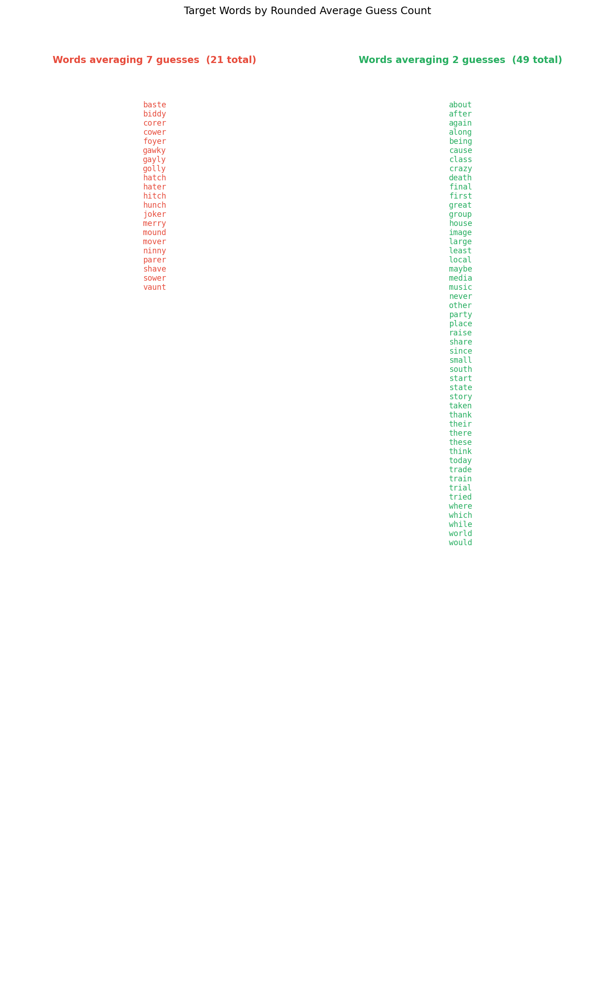

# Week 1 Report

## Updates

- Learned Markdown basic formatting
- I didn't like how few guessable words there are, and that they're hard-coded into the python file, so I had Claude download lists for the guess words and answer words
- Put docstrings on every function, the autocomplete is very annoying because if I wanted an AI's opinion on the function I wouldn't be typing
- I wrote a first draft for the simulator design doc
- Wrote a prompt for claude and let it do whatever
- Upon running then reviewing simulator.py, I realized it's not testing wordl.py, it's just simulating wordle using functions from wordl.py
- I figured out how to turn off copilot inline suggestions
- An excerpt from Claude's train of thought:
    >I'm realizing there's a problem with how I'm recording the target word in the CSV. Since the game is a black box, I don't actually know what the target word is on wins—only on losses when the game reveals it. I need to either parse that message when it appears or accept that some entries won't have the target word.
    >
    >Actually, I just realized something: on a win, the last guess I made must be the target word, since I guessed it correctly. So I can use that as the target for wins, and for losses I'll parse the "The word was: X"

    Claude might be an idiot.
- Claude spent at least 13k tokens fixing this, but the new simulator works and can run 20000 tests in 3 minutes
- Read through the simulator to see what it is doing, added some comments
- The driver class is very complicated in order to deal with reading/writing bytes to a python subprocess, I should look into how it did that
- Planned data visualizer, then consulted Claude. I would like to do this myself, but I don't believe I have time
- The first version of image.py made very unenlightening charts, so I redid it with more useful types of chart for the two things I was trying to show

## Simulator
The simulator should be isolated from the game, meaning it only interacts with the wordl.py functionality. I can have the simulator just interface with it like a user so that wordl.py doesn't need to be updated. I will have claude implement the simplest wordle solver by making it use english word frequency data to pick the next most common word to guess that uses every hint from the previous guesses. It will play like a mostly strategy-less person, on hard mode in tthe NYT app, who guesses the most common word first.

The most interesting data to gather would be performance with different starting words. With 1000 attempts, I think the most data we can gather is 25 starting words with 40 games each, or 10 words with 1000 games each. I'd have it record the # of guesses required for each starting word and answer word, for the same answer word in each. Then I can plot the number of guesses fore each starting word. If that works, I might have the test set be all 2000 words for all 10 starting words. Beyond that, I could take inspiration from https://www.youtube.com/watch?v=v68zYyaEmEA, but I don't really want the most intelligent solver so I'll probably keep things simpler.
### Prompt
"Design a simulator for the wordl game. Step 1 is to add a 'simulation mode' to wordl.py that makes it select the same words from answers.txt every time instead of random ones. Then, create a standalone python program that tests wordl.py. It should play like a player with no strategy, simply guessing the next most common word that fulfills every hint (like hard mode in the NYT app). You will have to incorporate five-letter word frequency data into the program. It should run 100 tests on 10 different starting words: Adieu, Stare, Slate, Audio, Raise, Crane, Arise, Irate, Train, Great. Record the number of guesses required to solve in a CSV format, associated to the starting word and target word. Store this project in a new folder. Run it in an environment that prevents print statements from slowing the program down, if necessary."

Claude had a bunch of unexplained pseudocode functions in its plan but I ran it anyway (mistake)

### Editing

I made it use all answer words in testing because it makes sense to test every word (we only get 5% of the entire answer list with only 100 guesses which). This takes forever.

Claude imports the score_guess function from wordl.py and runs its own simulation in simulate.py. I should have told it to treat wordl.py as a black box application that it has to run rather than something it can access the internals of. It's still a little weird that it does that, since I told it to add a simulation mode to wordl.py that it never used. I will reprimand it for this.
 - "Simulate.py should treat wordl.py (or py wordl.py --simulate) as a standalone application, it doesn't have access to any private functions or answers.txt or words.txt either, it has to interact with the games interface. If there needs to be a wrapper to avoid printing too much when playing the game, implement that."
 
I ran this in *Ask before edits* mode to see how that compares to plan mode for bigger prompts, it took almost an hour to do.

### Final product
- Interacts with wordl.py
- Tests 10 different starting words (The most common ones) against every possible answer word
- Completes ~23000 tests in 3 minutes (Claude was very proud)
- Writes score data to a csv
- The starting words are hard coded (for simplicity), but there's also no way to change how many answers are tested, or whether they're random, so it would be nice to add flags that allow those to be specified. The way it handles reading the output also feels precarious, but I don't know that anything can be done.

It gets its own possible wordlist and uses an abstract solver class that updates lists in a loop + a driver class that uses the solver and deals with the IO using the subprocess module to contain stdin and stdout from the python output, reading into a byte queue with a hard-coded end string, which apparently has to be asynchronous or else the OS pipe thing would get full. play_game makes sense, but the rest of the WordlDriver class is chicanery, it had a lot to say in the INIT function but idk what any of it means. The simulator would have been a lot easier for Claude to build if Claude didn't shoot itself in the foot trying to be so fancy with the way wordle is printed, but it did have the foresight to make the guess box letters different from the keyboard letters, so it can disregard everything with a 'background' color.

## Data Visualizer
### Planning
I have a csv with 10 starting words, each with 2300 answer words and an associated score. I can plot the scores for each starting word, as well as win percentage. I could also have some way to display the easiest and hardest answer words to guess. https://medium.com/codex/beyond-matplotlib-and-seaborn-python-data-visualization-tools-that-work-3ef7f8d1500e
- **Matplotlib**
    - I've already used it
    - I don't need the prettiest graph
    - According to Claude, this will give me the most control to make the best graph
- **Bokeh**
    - recommended by medium article
    - outputs to html or something, not optimal
- **Seaborne**
    - apparently looks nicer than Matplotlib by default
    - Higher level than Matplotlib
    - Claude said no

### Prompt
"Write a data visualizer in python using Matplotlib to handle results.csv, use pandas if 23000 is big enough. The program will analyze the data to find the win % of each starting word, and find the 5 target words with the highest average score and the 5 with the lowest. The program should produce two image files: one is a scatter plot, with each starting word on the X-axis and the number of guesses on the Y-axis; All guesses >6 should be red and seperated by a thin line (if matplotlib can do that); each starting word should have win % below it; the average for each word should be visible on the plot. The second image should be a bar chart with the 10 most and least guessable words on the X-axis, and the average # of guesses on the Y-axis."

Both of these are terrible, I want a histogram for the first one and I didn't realize ther would be so many 2s and sevens, so Im gonna have it make a list of those instead

"update the visualize.py: image 1 should have histograms for all 10 words instead of scatter plots, with a vertical bar on the x-axis for the average, and the second image should just be a list of words that are 7 and a list of words that are 2"

### Images
1. Histogram with all 10 starting words

- This looks good, I don't like the inconsistent y-axis labelling and will change that. 
- Although it's the right format to compare starting words, the data reveals that these words are functionally identical. To make this a more useful analysis, I would update the wordle solver to pick strategic guesses, since its current dumb method doesn't have any useful data and also loses frequently.
- The similar data could also be explained by the fact that I tested the most common starting words used by people, which might make them perform similarly
---
2. List of guaranteed fail words and guess-in-2 words

- This one is hideous
- Probably didn't need to be an image
- Reveals the words the solver always fails at, maybe because some aren't common enough, but it's more likely it just sucks
- The words that are always guessed in 2 are probably the most common 5-letter words
## TODO
- Figure out how Claude ran the python subprocess in WordlDriver
- Figure out how to push to GitHub
- Comment on visualize.py, pandas and more-than-rudimentary Matplotlib would be good to know
- Update it to make the second image less hideous and fix a couple of things with the first
- Verify hypotheses from second image