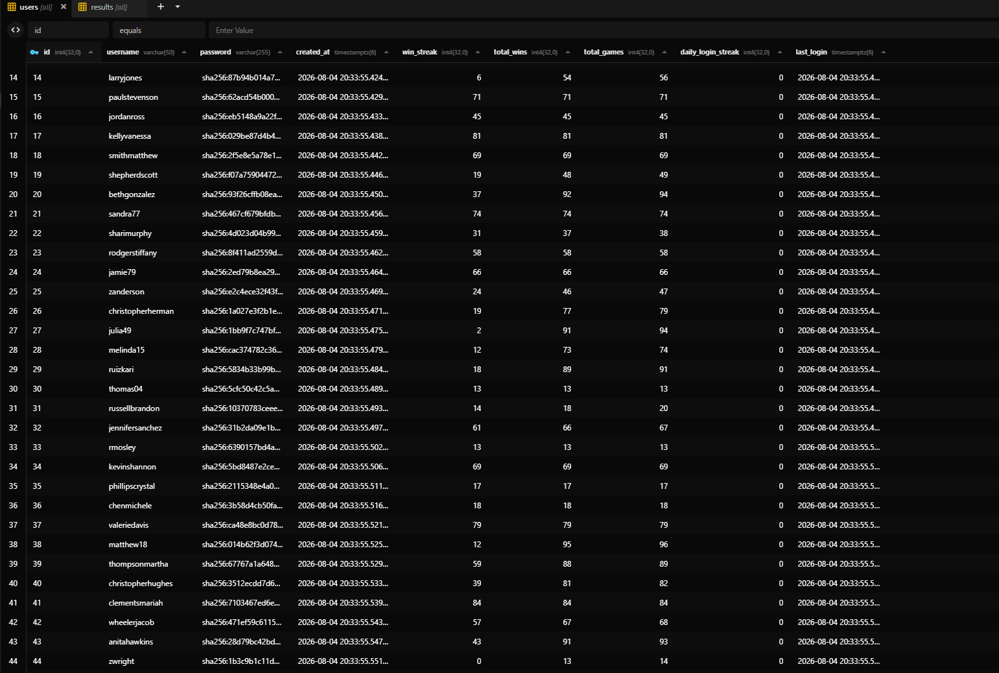
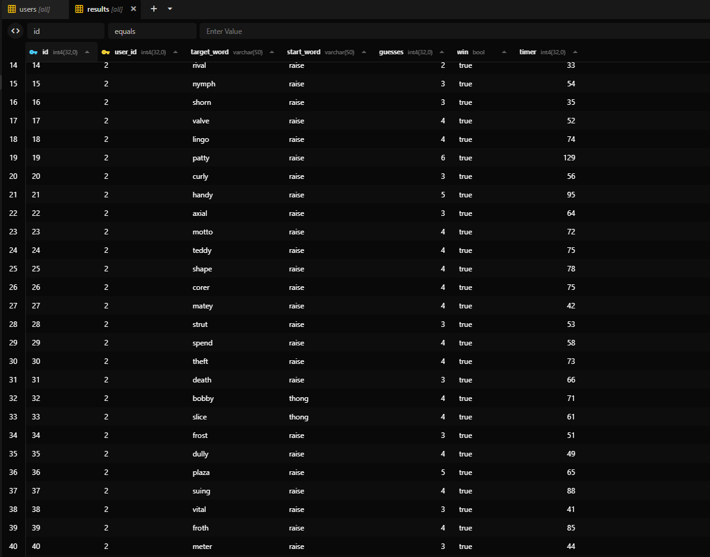
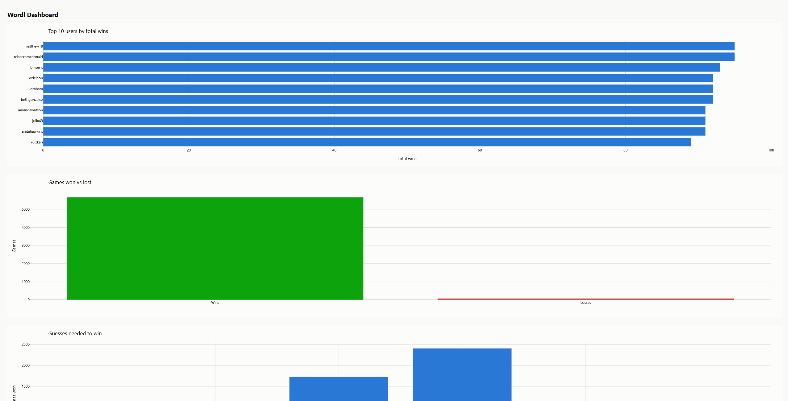
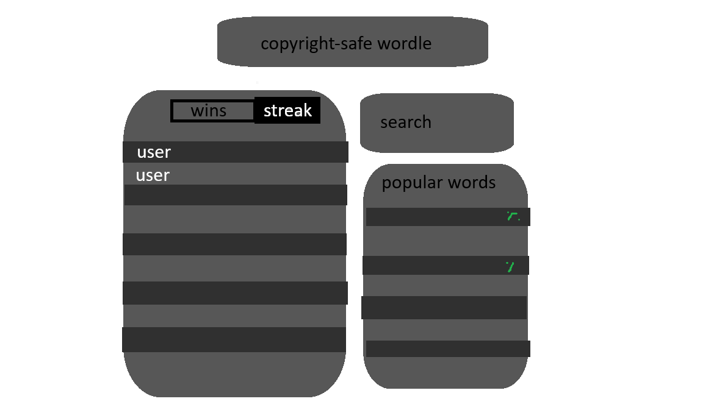
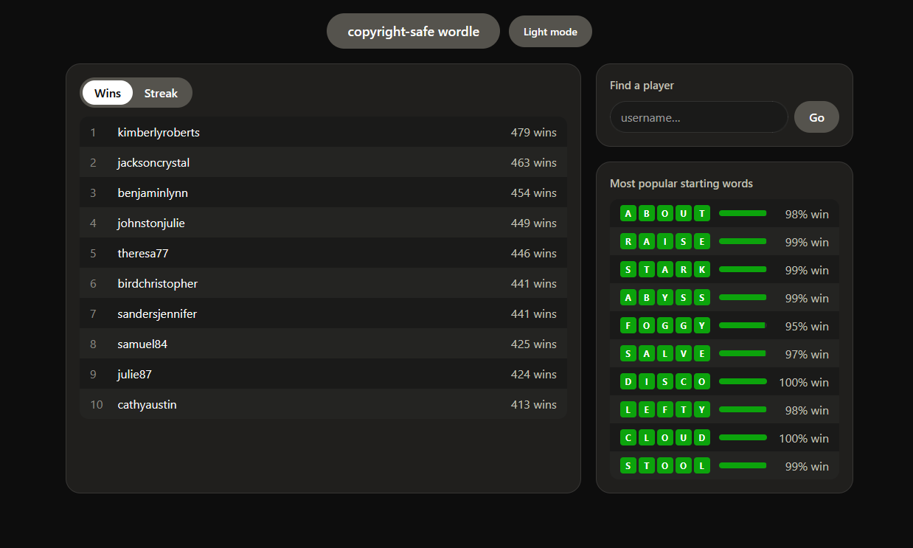
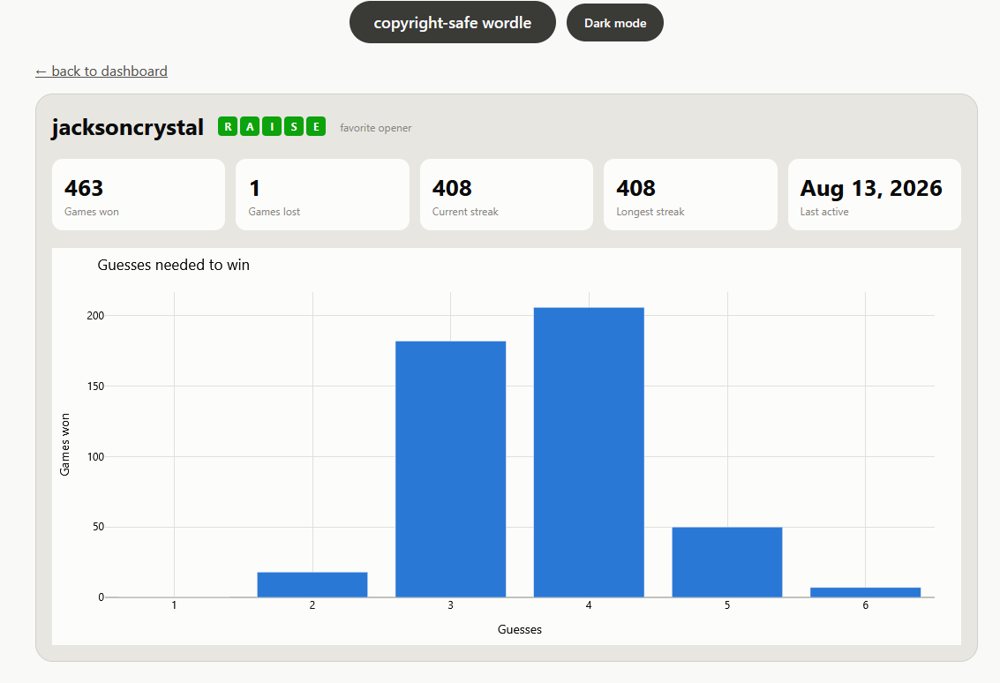

# Week 3 Report
## Updates
- added docstrings back to wordl
- made postgres connection work from a .env, and added an example .env as suggested by claude
- edited database to have user statistics stored in user table and a user index, updated in wordl
- looked into cron thingy
- fixed last_log null thing again
- made simulator
- pondered on how to do daily_streak, we decided a second docker runs scripts that interact with the postgres, and then I decided wordl.py must commune through http to some server instead of direct sql because the user might be evil. From now on, every change must be made with the future server setup in mind.
- gave it basic dashboard instructions
- Before I fixed the dashboard, I decided it would be a website running on the server
- made a docker-compose
- organized the repository into a client and server (abridging from here because I did a lot out-of-order and din't record it)
- Claude set up a container that can run Flask apps, built a daily reset script activated by cron scheduler (Unix services are horrible), which initially reset daily streaks every day unless you logged in at exactly at midnight
- 1 billion docstrings
- With the container made, the dashboard became a website, then the db handling was moved from wordl.py to a flask app that communicates through http to the wordl game
- Added command line parameters for the simulator
- Cleaned up everything so that environment variables could be set instead of hardcoding things into 5 different python files
- Fixed up READMEs

## Stored User Data
After some deliberation, I decided that some user statistics would be stored in the `users` table, and updated by querying the `results` table after every game to hopefully avoid the values drifting. If we have a dashboard, a user should be able to check statistics quickly, and certain values need to be easy to search to have a global leaderboard. Users care about their own win rate as well as the global meta (best starting words), a ranking of the best players and their win rates and streaks, breakdowns of the best and worst starting words/any word, and we need to incentive players with daily login streaks as any good predatory app does. I stored all the relevant statistics in the user table, so that leaderboard can update fast and other stats are derived as needed.

## Simulation
The simulator should create usable data to get a feel for the dashboard (everything except the daily login stuff should have believable user patterns, since that sounds like a headache).
**"update simulate.py so that it uses random target words from wordl instead of them sequentially. Generate around 100 basic names and passwords, use a library to help. Each of these users should have a favorite starting word, but each is randomly assigned a percentage of favorite vs random valid word. In addition, 1/3 should be skilled, meaning they guess based on the information they expect to obtain (you can search for external data for this), while 2/3 are unskilled and guess the next most common random word, as before. Play between 12-100 games each, but for testing purposes keep the range to 1-2 so that this doesn't take forever to debug."**

I will allow `simulate.py` to have access to wordl since the new purpose is to stress-test the database integration rather than the game itself, and claude is scared it will take forever if it has to interact with jank ANSI. I made sure running multiple simulations would work. Works flawlessly, even fakes a timer. The information approach claude found was what I was looking for so it did a good job.

    
    

The simulator makes the most sense as an admin tool to fill the database rather than one that would have to make a ton of http requests to play for the user, so it's in the Server side. To give the database manager more control when fabricating a userbase, I added the num_players and min/max range as sys arguments. It's still pretty slow, but that might be because of the amount of list iterating.

## Dashboard
I gave it the prompt and told it to keep it simple. It is truly horrible but it is a start.

list of things the dashboard will need:
- global leaderboard based longest streak or total games won (probably the centerpiece), with clickable profiles on main page
- profile pages showing games won/lost, most used starting word, max streak, current streak, last login, guesses needed histogram
- profile search on main page
- most popular starting words, with their associated winrate on main page
- gray with rounded corners (vibecoded website special)
- something like this:

I allowed it to see these specifications and told it to generate that, and it looks better than the paint mockup and ran surprisingly well with the database, although the fonts were initially all unreadable in dark mode. I didn't have to touch any HTML or CSS since it's all in the template files, thankfully. The charts are generated in `dashboard.py`, which can run to create a single html file. Since the move to a server however, it made sense to turn the dashboard into a website. `dashboard_app.py` runs creates a blueprint that runs in the main Flask app, using the functions from `dashboard.py`. The plotly graphs are regenerated every 3 seconds and updated with plotly.react in the js script, which also lets them be interactive html elements. Plotly also has to be forced to generate the histogram with all six numbers, even if a user never guessed in 1.

    
    

## Server setup

Two containers are built in docker-compose: a python-slim one (which is a debian image), which runs cron and the Flask app, and beneath it the Postgres server. Flask has two blueprints active in `main.py`: one from `admin/game_server.py` gets POSTS from wordl.py, which sends game and login data through in json form through http (with token authorization), and the other is from `dashboard/dashboard_app.py` used as the dashboard website. Auth.py and db.py contain boilerplate functions lifted from wordl.py that get used everywhere else. Cron runs every day at midnight on the prime meridian, which calls the streak resetting script `scheduler/reset_daily_streak` (apparently the defualt behavior is to try and email the logged results). This way, the only thing a client needs is a URL to have results saved and to access the leaderboard, while the server can handle many users connected. Posting score updates to the server requires a token given by game_server.py, but the username and password are sent as plain text over http so there's not much security, and nothing stopping the user from messing with the python itself because there's no point to doing anticheat stuff. The dashboard isn't 100% live because that would be extra extravagant, but it always has updated results after reloading so it's still real-time. I tried to organize the server directory to keep as much out of the way as possible, but for ease of use the docker-compose and db.py needed to be exposed. Now, the only things going on in the client is the game itself and the words.

## Future Direction

none because the natural next move is compiling the wordl app into a website too. There is also room to make it the predatory mobile game it was designed to be, users are rewarded with gems that they can also purchase, allowing them to unlock starting words (adieu would have to be premium content). The server would spam them with promotional emails and account deletion/unsubscription is tied to a multi-business day timer before anything happens.